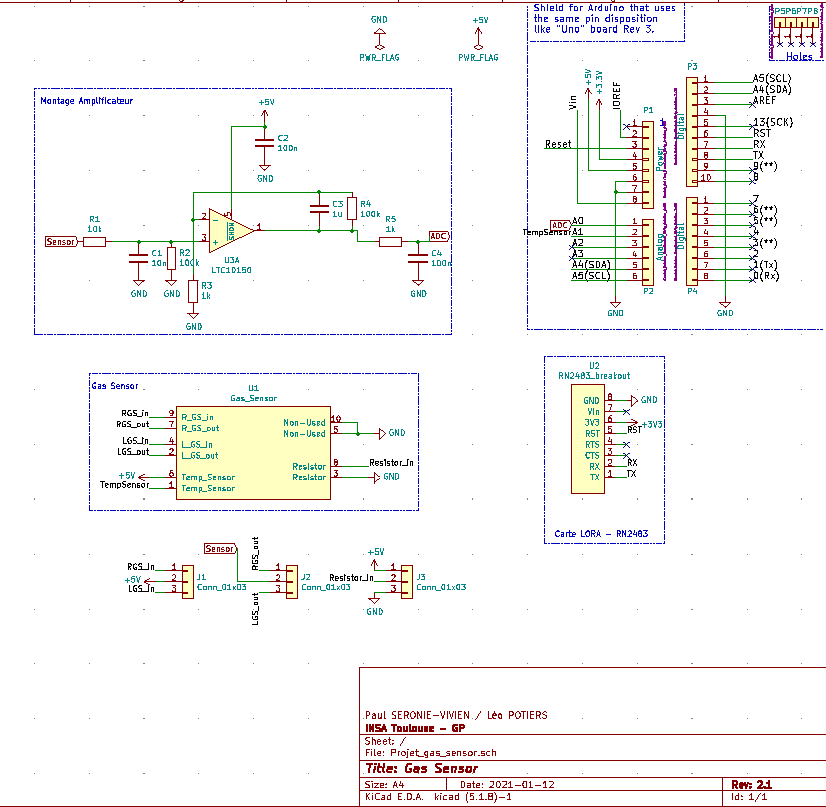

# 2020-2021-POTIERS_SERONIE-VIVIEN

This project is part of the 5ISS year formation at INSA Toulouse.
After designing a nanoparticle gas sensor in the AIME laboratory at INSA Toulouse, we worked on the modeling of the assembly that would allow us to publish its measurements on the campus LoRa gateway.

Tool used : http://kicad-pcb.org/

# KiCad PCB 

The final structure is composed of :

- [x] The gas sensor
- [x] An amplifier stage for home-made gas sensor
- [x] A LoRa RN-2483 microchip for the data transmission
- [x] The Arduino Uno Shield that uses the same pin disposition as Uno board REV 3

# Datasheets of main components

- [x] Datasheet of the LoRa microchip
- [x] Datasheet of the home-made gas sensor
- [x] Datasheet of the Arduino UNO board

# To-Do List 

 - [x] Create KiCad project
 - [x] Design the circuit board
 - [x] Assign the components footprints
 - [x] Design of the pcb
 - [x] Component placement
 - [x] Routing

